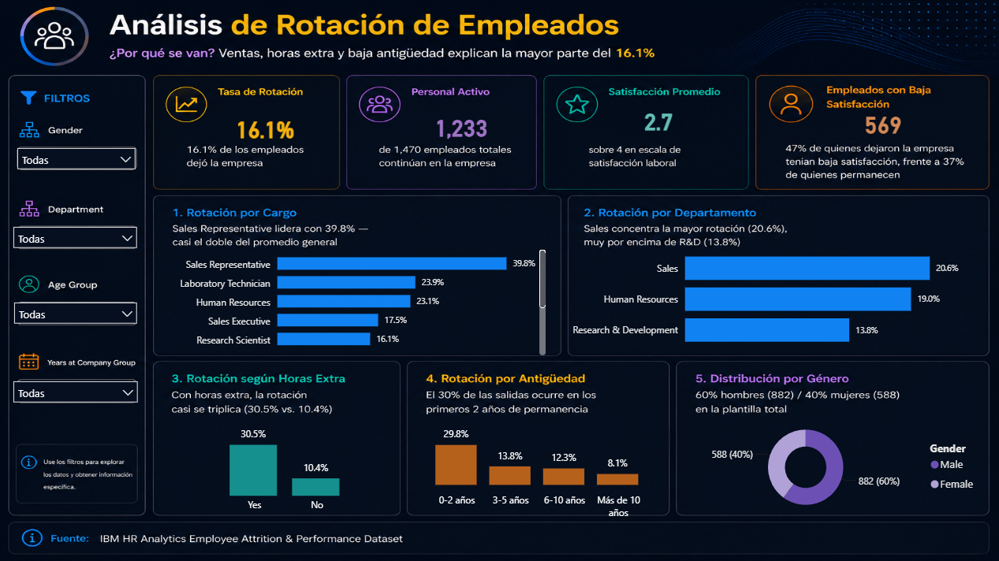

# 📊 HR Analytics Dashboard | Análisis de Rotación de Empleados

## 📌 Resumen del proyecto

La rotación de personal es una de las métricas más importantes de Recursos Humanos: impacta directamente los costos de reclutamiento, la productividad, el compromiso de los empleados y el desempeño organizacional.

Este proyecto analiza el dataset **IBM HR Analytics Employee Attrition & Performance** usando **SQL, SQLite y Power BI** para identificar los factores asociados a la rotación de empleados y convertir datos crudos de RR.HH. en insights accionables.

El entregable final es un dashboard interactivo que ayuda a un gerente de RR.HH. a entender **dónde ocurre la rotación, por qué se van los empleados, y qué perfiles tienen mayor riesgo de renuncia.**

## 🎯 Problema de negocio

La empresa presenta rotación de personal, pero carece de visibilidad sobre:

- Qué departamentos tienen la mayor rotación
- Qué cargos son los más afectados
- Si las horas extra influyen en las renuncias
- Si la satisfacción laboral está relacionada con la rotación
- En qué etapa de la permanencia del empleado ocurre más la rotación

El objetivo es responder estas preguntas con datos y ofrecer recomendaciones para mejorar la retención.

## 🛠️ Herramientas utilizadas

- SQL / SQLite
- DB Browser for SQLite
- Visual Studio Code
- Power BI + DAX
- Git & GitHub

## 📂 Dataset

- **Nombre:** IBM HR Analytics Employee Attrition & Performance
- **Fuente:** [Kaggle](https://www.kaggle.com/datasets/pavansubhasht/ibm-hr-analytics-attrition-dataset)
- **Tamaño:** 1,470 empleados × 35 variables
- **Valores nulos:** 0 — dataset limpio
- **Naturaleza:** dataset ficticio creado por IBM para fines educativos y de práctica de analítica de RR.HH.

El diccionario completo de las 35 variables está en el [Apéndice](#-apéndice-diccionario-de-variables).

> **Nota sobre alcance:** el dataset no incluye una variable de ausentismo (`AbsenteeismRate`). El proyecto se enfoca en los KPIs que sí se pueden calcular de forma confiable: rotación, satisfacción, desempeño, compensación y antigüedad.

## 📁 Estructura del repositorio

```text
hr-analytics-dashboard/
│
├── data/
│   ├── WA_Fn-UseC_-HR-Employee-Attrition.csv
│   └── hr_analytics.db
│
├── sql/
│   ├── 01_import_data.sql
│   ├── 02_exploration.sql
│   ├── 03_hr_analysis.sql
│   └── 04_views.sql
│
├── powerbi/
│   ├── HR_Analytics_Dashboard.pbix
│   └── dashboard_preview.png
│
└── README.md
```

## 📊 Preguntas de negocio

- ¿Qué departamentos tienen la mayor rotación?
- ¿Qué cargos son los más afectados?
- ¿Las horas extra aumentan la rotación?
- ¿La satisfacción laboral influye en las renuncias?
- ¿Qué empleados tienen mayor probabilidad de irse?
- ¿Cómo afecta la antigüedad a la rotación?

## 📷 Dashboard



**Título:** Análisis de Rotación de Empleados
**Subtítulo:** ¿Por qué se van? Ventas, horas extra y baja antigüedad explican la mayor parte del 16.1%

| KPI | Valor |
|---|---|
| Tasa de Rotación | 16.1% |
| Personal Activo | 1,233 de 1,470 empleados totales |
| Satisfacción Promedio | 2.7 / 4 |
| Empleados con Baja Satisfacción | 569 |

## 🧮 Medidas DAX

Las siguientes medidas fueron creadas en Power BI para calcular 
los KPIs principales del dashboard.

---

### Tasa de Rotación
Calcula el porcentaje de empleados que abandonaron la empresa 
sobre el total. Usa `DIVIDE` para evitar errores de división 
por cero.

```dax
Tasa Rotación = 
DIVIDE(
    COUNTROWS(
        FILTER(
            hr_employees,
            hr_employees[Attrition] = "Yes"
        )
    ),
    COUNTROWS(hr_employees),
    0
)
```

**Resultado:** 16.1%

---

### Headcount Activo
Cuenta únicamente los empleados que permanecen activos 
en la empresa (Attrition = "No").

```dax
Headcount Activo = 
CALCULATE(
    COUNTROWS(hr_employees),
    hr_employees[Attrition] = "No"
)
```

**Resultado:** 1,233 empleados

---

### Satisfacción Promedio
Calcula el promedio del nivel de satisfacción laboral 
en una escala de 1 (Baja) a 4 (Alta).

```dax
Satisfacción Promedio = 
AVERAGE(hr_employees[JobSatisfaction])
```

**Resultado:** 2.7 sobre 4

---

### Empleados con Baja Satisfacción
Cuenta los empleados con niveles de satisfacción 
bajos (1) o medio-bajos (2).

```dax
Empleados con Baja Satisfacción = 
CALCULATE(
    COUNTROWS(hr_employees),
    hr_employees[JobSatisfaction] <= 2
)
```

**Resultado:** 569 empleados (38.7% del total)
> 47% de quienes dejaron la empresa tenían baja satisfacción,
> frente al 37% de quienes permanecen.

## 🔍 Hallazgos principales

### Rotación general
- 16.1% de rotación global
- 237 empleados dejaron la empresa · 1,233 permanecen activos

### Por departamento
| Departamento | Rotación |
|---|---|
| Sales | **20.6%** |
| Human Resources | 19.0% |
| Research & Development | 13.8% |

### Por cargo
| Cargo | Rotación |
|---|---|
| Sales Representative | **39.8%** |
| Laboratory Technician | 23.9% |
| Human Resources | 23.1% |

### Horas extra
El factor más fuerte del análisis: quienes hacen horas extra rotan casi 3 veces más.
| Horas extra | Rotación |
|---|---|
| Sí | **30.5%** |
| No | 10.4% |

### Antigüedad
La rotación se concentra en los primeros años y cae de forma sostenida después.
| Antigüedad | Rotación |
|---|---|
| 0–2 años | **29.8%** |
| 3–5 años | 13.8% |
| 6–10 años | 12.3% |
| Más de 10 años | 8.1% |

### Satisfacción laboral
- 47% de quienes **dejaron** la empresa tenía baja satisfacción (niveles 1-2)
- 37% de quienes **permanecen** reporta baja satisfacción

### Hallazgo descartado (transparencia metodológica)
Se evaluó si el salario promedio explicaba las diferencias de satisfacción laboral. La diferencia entre el salario promedio del nivel más bajo y el más alto de satisfacción fue de apenas $89 — no hay una relación clara entre salario y satisfacción en este dataset.

## 📖 Storytelling: cómo se lee el dashboard

**1. Entender la plantilla actual**  tamaño del equipo, rotación general, satisfacción promedio.
**2. Identificar dónde ocurre la rotación** Sales y Sales Representative concentran la mayor parte del problema.
**3. Entender por qué se van**  horas extra y baja antigüedad son los predictores más fuertes.
**4. Actuar**  RR.HH. puede mejorar la retención enfocándose en el grupo de mayor riesgo en vez de aplicar iniciativas generales a toda la empresa.

## 💡 Recomendaciones de negocio

Priorizar estrategias de retención en empleados que:

- Trabajan en Sales
- Ocupan el cargo de Sales Representative
- Realizan horas extra con frecuencia
- Tienen menos de 2 años en la empresa
- Muestran baja satisfacción laboral

En vez de iniciativas de retención genéricas para toda la empresa, los recursos deberían concentrarse en este perfil de alto riesgo.

## ⚠️ Limitaciones

- El dataset es una muestra estática (no longitudinal): no permite ver si la rotación cambia en el tiempo.
- Las relaciones encontradas son **asociaciones, no causalidad**  por ejemplo, no se puede afirmar que las horas extra *causen* la renuncia, solo que están fuertemente asociadas.
- No incluye variable de ausentismo ni la razón de salida (renuncia voluntaria vs. despido).

## 🚀 Cómo reproducir el proyecto

1. Descargar el dataset desde el link de Kaggle indicado arriba y colocarlo en `data/`.
2. Importar el CSV a SQLite.
3. Ejecutar los scripts de `sql/` en orden (01 → 04).
4. Abrir `powerbi/HR_Analytics_Dashboard.pbix` en Power BI Desktop.
5. Actualizar el modelo de datos si es necesario.
6. Explorar el dashboard interactivo.

## 👩‍💻 Autor

**Isbeth Hernandez**
Analista de Datos

- LinkedIn:https://www.linkedin.com/in/isbeth-andrea-hernández-soto-/
- GitHub:https://github.com/isbethahs
- Portafolio: https://isbethhernandezsoto.lovable.app

## ⭐ Estado del proyecto

✅ Completado

---

## 📖 Apéndice: Diccionario de variables

| Columna | Tipo | Valores únicos | Descripción |
|---|---|---|---|
| Age | Numérica | 43 | Edad del empleado |
| Attrition | Categórica | 2 (Yes/No) | Si el empleado dejó la empresa — variable objetivo |
| BusinessTravel | Categórica | 3 | Frecuencia de viajes de negocio |
| DailyRate | Numérica | 886 | Tarifa diaria |
| Department | Categórica | 3 | Departamento (Sales, R&D, HR) |
| DistanceFromHome | Numérica | 29 | Distancia del hogar al trabajo (km) |
| Education | Ordinal | 5 | Nivel educativo (1=Below College … 5=Doctor) |
| EducationField | Categórica | 6 | Campo de estudio |
| EmployeeCount | Constante | 1 | Siempre 1 — **sin valor analítico, se elimina** |
| EmployeeNumber | ID | 1470 | Identificador único del empleado |
| EnvironmentSatisfaction | Ordinal | 4 | Satisfacción con el ambiente laboral (1=Baja … 4=Muy alta) |
| Gender | Categórica | 2 | Género |
| HourlyRate | Numérica | 71 | Tarifa por hora |
| JobInvolvement | Ordinal | 4 | Nivel de compromiso con el puesto |
| JobLevel | Ordinal | 5 | Nivel jerárquico del puesto |
| JobRole | Categórica | 9 | Rol específico del puesto |
| JobSatisfaction | Ordinal | 4 | Satisfacción laboral (1=Baja … 4=Muy alta) |
| MaritalStatus | Categórica | 3 | Estado civil |
| MonthlyIncome | Numérica | 1349 | Ingreso mensual |
| MonthlyRate | Numérica | 1427 | Tarifa mensual (no confundir con MonthlyIncome) |
| NumCompaniesWorked | Numérica | 10 | Número de empresas anteriores |
| Over18 | Constante | 1 | Siempre "Y" — **sin valor analítico, se elimina** |
| OverTime | Categórica | 2 | Si el empleado hace horas extra |
| PercentSalaryHike | Numérica | 15 | % de incremento salarial |
| PerformanceRating | Ordinal | 2 | Calificación de desempeño (solo 3 y 4 presentes) |
| RelationshipSatisfaction | Ordinal | 4 | Satisfacción en relaciones laborales |
| StandardHours | Constante | 1 | Siempre 80 — **sin valor analítico, se elimina** |
| StockOptionLevel | Ordinal | 4 | Nivel de opciones sobre acciones |
| TotalWorkingYears | Numérica | 40 | Años totales de experiencia laboral |
| TrainingTimesLastYear | Numérica | 7 | Capacitaciones recibidas el último año |
| WorkLifeBalance | Ordinal | 4 | Balance vida-trabajo |
| YearsAtCompany | Numérica | 37 | Antigüedad en la empresa actual |
| YearsInCurrentRole | Numérica | 19 | Años en el puesto actual |
| YearsSinceLastPromotion | Numérica | 16 | Años desde el último ascenso |
| YearsWithCurrManager | Numérica | 18 | Años con el jefe/manager actual |

## 📄 Licencia

Este proyecto está bajo la licencia MIT.


---

> 📊 Dataset: [IBM HR Analytics Employee Attrition & Performance](https://www.kaggle.com/datasets/pavansubhasht/ibm-hr-analytics-attrition-dataset) 
> — Disponible públicamente en Kaggle bajo licencia Open Database (ODbL).
>
> Este proyecto es de uso educativo y de portafolio profesional.